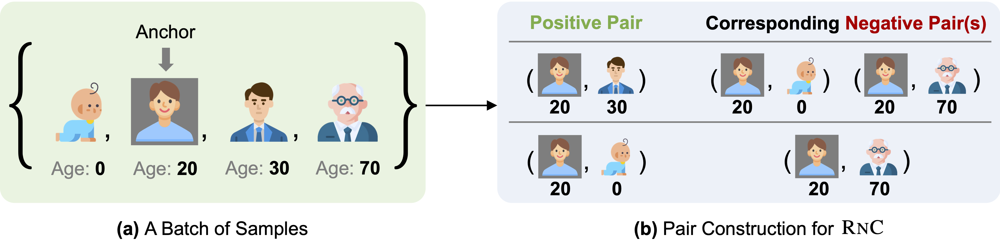

## Rank-N-Contrast: Learning Continuous Representations for Regression

[Paper](https://arxiv.org/abs/2210.01189) | [Talk](https://youtu.be/T7TCBDmxMO0?si=l4SBKnIu26k9uqVH) | [BibTex](assets/bibtex.txt)



Rank-N-Contrast: Learning Continuous Representations for Regression\
[Kaiwen Zha](https://people.csail.mit.edu/kzha/)\*, [Peng Cao](https://people.csail.mit.edu/pengcao/)\*, [Jeany Son](https://jeanyson.github.io/), [Yuzhe Yang](https://www.mit.edu/~yuzhe/), [Dina Katabi](http://people.csail.mit.edu/dina/) (*equal contribution)\
_NeurIPS 2023 (Spotlight)_

### Loss Function
The loss function [`RnCLoss`](./loss.py#L34) in [`loss.py`](./loss.py) takes `features` and `labels` as input, and return the loss.
```python
from loss import RnCLoss

# define loss function with temperature, label difference measure, 
# and feature similarity measure
criterion = RnCLoss(temperature=2, label_diff='l1', feature_sim='l2')

# features: [bs, 2, feat_dim]
features = ...
# labels: [bs, label_dim]
labels = ...

# compute RnC loss
loss = criterion(features, labels)
```

### Running
Download AgeDB dataset from [here](https://ibug.doc.ic.ac.uk/resources/agedb/) and extract the zip file (you may need to contact the authors of AgeDB dataset for the zip password) to folder `./data`.

- To train the model with the L1 loss, run 
    ```
    python main_l1.py
    ```
- To train the model with the RnC framework, first run 
    ```
    python main_rnc.py
    ```
    
    to train the encoder. The checkpoint of the encoder will be saved to `./save`. Then, run
    ```
    python main_linear.py --ckpt <PATH_TO_THE_TRAINED_ENCODER_CHECKPOINT>
    ```
  to train the regressor.

### Model Checkpoints
The checkpoints of the encoder and the regressor trained on AgeDB dataset are available [here](https://drive.google.com/file/d/11_W-wArbk5lgTCKyJY0fsPoALbx_Qkno/view?usp=sharing).

### Citation
If you use this code for your research, please cite our paper:
```bibtex
@inproceedings{zha2023rank,
    title={Rank-N-Contrast: Learning Continuous Representations for Regression},
    author={Zha, Kaiwen and Cao, Peng and Son, Jeany and Yang, Yuzhe and Katabi, Dina},
    booktitle={Thirty-seventh Conference on Neural Information Processing Systems},
    year={2023}
}
```
